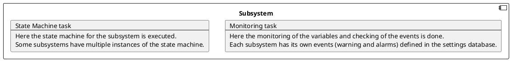
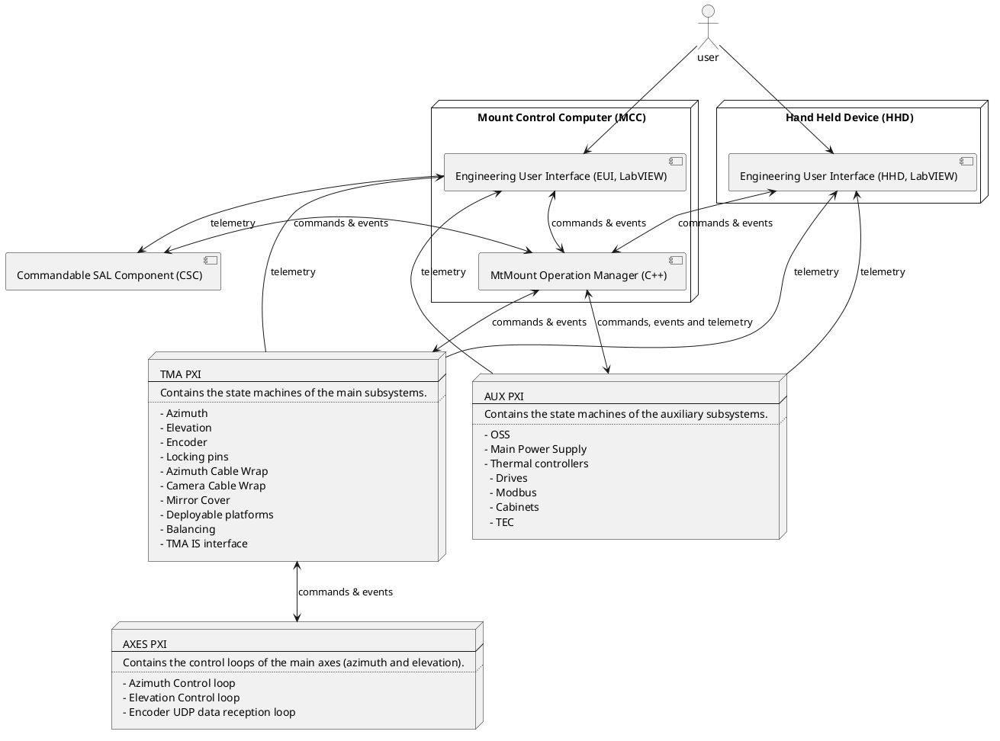
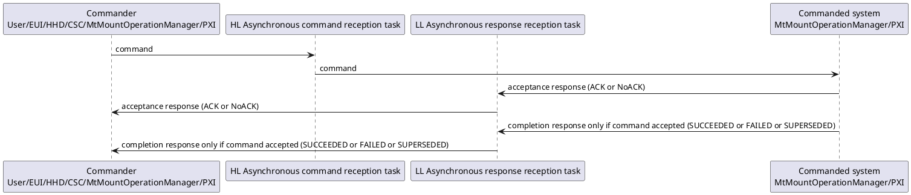
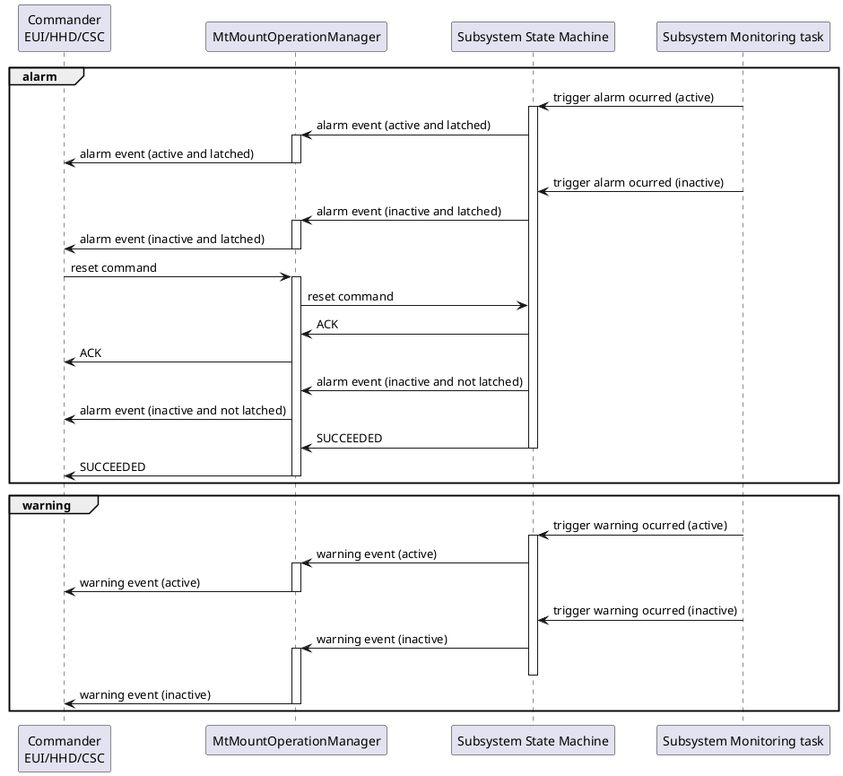

# MCS SW Design Report

| **Requested by:** | **GHESA** |
| --- | --- |
| **Doc. Code:**    | 3151_MCS_0002 |
| **Editor:**       | Julen Garcia |
| **Approved by:**  | Ismael Ruiz de Argandoña |

## Introduction

This document contains the description of the software (SW) design of the TMA control system and it is divided into two
main chapters. In the first one, the structure of all the SW programs forming the MCS are described. In the
second one, the behavior of some of the most important tasks of these programs is detailed.

## Reference documents

| Document | Code | Version |
| --- | --- | --- |
| MCS Operation | 3151_MCS_0001 | 5 |
| Technical Specification. PLCopen - Technical Committee 2 – Task Force. Function blocks for motion control |  | 1.1 |

## Description of MCS functions and TMA subsystems

The TMA can be functionally divided into the following subsystems:

- **Azimuth axis**. The azimuth axis must be controlled in position in order to perform the requested point to point and
  tracking movements. This implies managing the linear drives, their power supply and their thermal control, the encoder
  system, hydrostatic bearing system, hydraulic brakes and controlling the position of the cable wrap system
- **Altitude (elevation) axis**.The elevation axis must be controlled in position in order to perform the requested point to
  point and tracking movements. This implies managing linear drives, their power supply and their thermal control, the
  encoder system, the hydrostatic bearing system, hydraulic brakes and locking pins
- **Balancing system**. The four actuators forming the balancing system must be controlled in position. The position of each
  actuator will be defined when performing the TMA balancing operation by measuring the current consumption of the main drives
- **Mirror Cover system**. The mirror cover system must be controlled in position in order to perform cover opening and
  closing operations. Four auxiliary actuators controlled in position have been added to block the cover in the retracted position.
- **Deployable platforms system**. The retractable/deployable platforms are used for maintenance and can be commanded from
  the user interface.
- **Camera cable wrap system**. The camera cable wrap system is controlled in position and is commanded by the CSC to follow the position of
  the camera rotator.
- **Cabinet thermal control system**. The cabinet thermal control system must control the surface temperature of the
  electrical cabinets while maintaining the internal temperature inside the operation range of the contained equipment.
- **Locking pins system**. The two actuators, there are two for redundancy, are for locking the elevation axis into the
  parking positions: zenith or horizon.
- **Main Power Supply system**. This is the power supply for the main drives uses to move Azimuth and Elevation axes.
- **OSS**. This is the Oil Supply System, responsible of keeping the telescope floating on an oil film to reduce friction.
- **Azimuth Cable Wrap system**. Is commanded in position by the azimuth axis, to make the wires follow the movements of
  azimuth.

In addition to controlling the subsystems, the MCS system is also in charge of performing the interface with the user
(by means of the Engineering User Interface, EUI, and the Hand-Held Device, HHD) and with the Commandable SAL Component (CSC)
in order to receive and process the commands to be executed and monitor the TMA variables (classified in topics) and events.
Finally, the MCS also performs the software supervisory functions required to ensure a safe operation of the TMA
(the safety related functions are executed by the TMA IS). For these supervisory tasks each subsystem has an
independent task that monitors the telemetry to trigger the configured alarms.



The following section describes the SW solution designed for the MCS in order to perform these functions.

## SW Structure

The diagram below shows the SW architecture of the MCS, indicating the main SW Programs, the interfaces among them and
the HW devices and operating systems that host each component.



As it can be appreciated in the previous diagram, the MCS SW architecture has a hierarchical design and each SW Program
is placed at a certain level of the hierarchy as detailed in the table below.

| Level | Program | Higher Level Program | Lower Level Program |
| --- | --- | --- | --- |
| 1 | User Interface | Operator | MtMount Operation Manager |
| 1 | CSC | Operator | MtMount Operation Manager and EUI |
| 2 | MtMount Operation Manager | CSC and User Interface (EUI or HHD) | TMA-PXI and AUX-PXI |
| 3 | TMA-PXI | MtMount Operation Manager | AXES-PXI and Intelligent HD devices (Bosch controller) |
| 3 | AUX-PXI | MtMount Operation Manager | Intelligent HD devices (OSS, Main Power Supply, Modbus temperature controllers) |
| 4 | AXES-PXI | TMA-PXI | Main Drives Ethercat line |

The SW Programs at each level have two main objectives that are commanding and monitoring the TMA, and all of them are
designed following the same design pattern that can be described by means of the following ideas.

For **commanding** the CAR (Command Action Response) communication scheme has been adopted. The communication between the
programs has been implemented using TCP/IP connections. Therefore, the following kinds of tasks are required in the
programs at each level:

- High Level (HL) Asynchronous command reception task. This task is in charge of receiving commands asynchronously from
  the higher level program(s) or from the operator. Whenever a command is received, an event (thread synchronization event)
  is set for the state machine task. Typical objects used in multithreaded applications (like mutexes) are
  used to share the data structure associated to the command with the state machine task. One task of this kind
  is required for each program at the higher level because blocking functions may be used for reading.
- State machine task. This task is an active object (event dispatcher and state machine manager) that processes the events
  (thread synchronization events) set by the High Level Asynchronous command reception task(s) and the Low Level Asynchronous
  message reception task(s). This task sends the commands to the lower level program(s) and the response messages
  (Ack, Done, Error, etc) to the higher level program(s). It can also send other notification events (state changes, etc)
  to the higher level program(s). This task only executes Run To Completion (RTC) actions.
- Low Level (LL) Asynchronous message reception task. This task is in charge of receiving messages asynchronously from
  the lower level program(s). One task of this kind is required for each program at the lower level because blocking
  functions are used for reading. Depending on the received message, two different actions are possible:
  - If these messages are responses (Ack, Done, Error, etc) to previously sent commands or asynchronous messages that
  are relevant for the state machine task, an event (thread synchronization event) is set for this task
  - If these messages are asynchronous events that are not relevant for the state machine task, they simply are transmitted
  to higher levels programs.



For **monitoring** only one kind of task is required in each program. This task receives telemetry data from the
lower level program(s) and writes them to the higher level program(s). These variables are sent using a custom TCP/IP
protocol from the PXIs that generate the telemetry in a hierarchical process up to the EUI where it's processed and sent
to the CSC. The EUI has the extra functionality of logging the read variables to a file for local data storage.

### MCC SW Programs

The main functions of the programs running in the MCC are:

- Interface with the operator by means of the Engineering User Interface or HHD:
  - Commanding. Commanding the TMA.
  - Monitoring. Display the TMA information (topics and events) received from the Subsystem control program to the
  operator and log it locally.
- Interface with the CSC by means of the MtMount Operation Manager and EUI:
  - Commanding. Allow commanding the TMA from the CSC, uses the MtMount Operation Manager.
  - Monitoring. Send the TMA information (topics and events) received from the Subsystem control program to the CSC.
    - Events are received from the MtMount Operation Manager.
    - Telemetry topics are received from the EUI.

The MtMount Operation management task manages the commands (received either from the EUI, HHD or CSC) and processes the
responses received from the PXIs as shown in the diagram from the [SW Structure section](#sw-structure). There are three
High Level Asynchronous command reception tasks, one for attending the commands requested by the operator through the EUI
(button pressing, etc), another equivalent for HHD, and a last one for receiving the commands from the CSC. And two Low
Level Asynchronous response reception tasks for received the responses for the two PXIs commanded by the operation manager.

The EUI functions are to implement the Engineering user interface, store the telemetry data locally and send the telemetry
data to the CSC by the use of the telemetry topics defined in a configuration file. For the user commands available, the
user interface (EUI/HHD) uses the approach defined in [SW Structure section](#sw-structure).

### HHD SW Programs

The main functions of the programs running in the MCC are:

- Interface with the operator by means of the Engineering User Interface:
  - Commanding. Commanding the TMA.
  - Monitoring. Display the TMA information (topics and events) received from the Subsystem control program to the
  operator.

The HHD functions are to implement the Engineering user interface. For the user commands available, the
user interface (HHD) uses the approach defined in [SW Structure section](#sw-structure). The version of the user interface
running in the HHD is lighter than the one on the MCC, as the functions required are less and the hardware is less
powerful. Therefore some task are executed less frequently and the screen data is updated less frequently too.

### PXI Subsystem Control Program

The main functions of this program are:

- Commanding. Execute the commands received from the MtMountOperationManager by controlling the operation of all subsystems of the TMA.
  The commands supported by the axes subsystems are based in the PLCOpen standard.
- Monitoring. Send the telemetry data from the TMA collected from all TMA sensors to the EUI and HHD.
- Supervision. Supervise the correct operation of all systems. For doing this, each subsystem has its own task that checks
  the status of all the variables relevant for the subsystem to detect any possible malfunctions and errors. If a malfunction
  is detected a trigger is sent to the subsystem state machine task. The state machine task manages the trigger,
  and depending of the malfunction level, it transits to fault state, sending the event information as a fault event,
  or maintain the current state and inform of the malfunction by sending the event information as a warning event.

The design pattern explained in [SW Structure section](#sw-structure) is not applied to this program in such a simple way
as to the other programs because controlling all the TMA subsystems requires some additional tasks that make the structural
design of this program more complex. However, as explained in the following paragraphs, the main ideas explained in
[SW Structure section](#sw-structure) are also applied to this program whenever possible.

The subsystems of the TMA and the functions for each of them are listed and explained below:

- Azimuth axis main functions:
  - Axis operation and control. For this function there are several subfunctions required:
    - Azimuth state machine task. Executed in the TMA-PXI.
    - Trajectory generation. A custom trajectory generation library has been developed. Executed in the AXES-PXI.
    - Axis interface. Using the ethercat communications to the main drives and monitoring the status. Executed in the AXES-PXI.
  - Encoder system interface. Using a two tasks:
    - Configuration task. Executed in the TMA-PXI.
    - Data UDP reception task. Executed in the AXES-PXI.
  - Azimuth Cable Wrap control. Executed in the TMA-PXI.
- Elevation axis main functions:
  - Axis operation and control. For this function there are several subfunctions required:
    - Azimuth state machine task. Executed in the TMA-PXI.
    - Trajectory generation. A custom trajectory generation library has been developed. Executed in the AXES-PXI.
    - Axis interface. Using the ethercat communications to the main drives and monitoring the status. Executed in the AXES-PXI.
  - Encoder system interface. Using a two tasks:
    - Configuration task. Executed in the TMA-PXI.
    - Data UDP reception task. Executed in the AXES-PXI.
- Locking pins control. Executed in the TMA-PXI.
- Balancing control. Executed in the TMA-PXI.
- Mirror Cover control. Executed in the TMA-PXI.
- Deployable Platforms control. Executed in the TMA-PXI.
- Camera Cable Wrap control. Executed in the TMA-PXI.
- TMA IS Interface. Executed in the TMA-PXI.
- Cabinet thermal control. Executed in the AUX-PXI.
- Drives thermal control. Executed in the AUX-PXI.
- TEC control. Executed in the AUX-PXI.
- OSS control. Executed in the AUX-PXI.
- Main Power Supply control. Executed in the AUX-PXI.

Here, the main functions to be executed by each subsystem and the subfunctions required by each function are listed.
The designed program structure is related to this function breakdown. Thus, inside the Subsystem
Control Program (Main VI), each TMA subsystem is associated to one VI (Subsystem VI), as well as each subsystem function
(Function VI) and each subfunction (Subfunction VI). Inside each Subfunction VI there is at least one loop (one thread).
This loop calls as many VIs (subVIs) as necessary to perform the desired operations in each case.

Some of the control functions required to the Subsystem Control Program are performed by intelligent external hardware
devices that are commanded and monitored by the Subsystem Control Program using the appropriate communication protocol.
Therefore the functionality required to perform these control functions is not implemented in the Subsystem Control Program
which only hosts the functions required to communicate with these devices for commanding and monitoring .
These devices are:

- Bosch controller. This PLC controller is responsible for managing the low level loops of the auxiliary motors used by
  the following subsystems: Locking Pins, Balancing, Deployable Platforms, Mirror Cover, Camera Cable Wrap and Azimuth
  Cable Wrap.
- Main drives power supply PLC. It manages the DC power supply to azimuth and elevation drives. Connected to the IOs
  EtherCAT line.
- OSS control PLC. It manages the hydrostatic bearings for azimuth and elevation. The communication  be via Modbus TCP
  and it is connected to the Ethernet TMA network.
- Main Axes motor section drives. They control the azimuth and elevation motors sections and are connected by EtherCAT.
- Cabinet thermal local controllers. They control the surface temperature of the cabinets and allow powering on
  temperature limited hardware. The communication is done via MODBUS TCP and they are connected to the Ethernet TMA network.
- Top End Chiller PLC. It controls the temperature of elements of the top end assembly, as well as the M2 mirror cell
  assembly. The communication is done via MODBUS TCP it is connected to the Ethernet TMA network.

Similar to other programs forming the MCS, there is a High Level Asynchronous command reception task, for receiving the
commands from the MtMountOperationManager via TCP/IP using a custom protocol. For each received command, a trigger to
the appropriate state machine for the corresponding subsystem is sent. Once received, the state machine performs the
checks for the received command and accepts or rejects the command, if the command is accepted an ACK is sent and if not
a reject (NoACK) is sent. If the commands is rejected the command actions end there and the command is cleared. If the
command is accepted, the command actions are executed, and when the actions are completed or interrupted a response is
sent accordingly as follows:

- SUCCEEDED. A command is completed successfully.
- FAILED. A command is not completed successfully.
- SUPERSEDED. A command is superseded by another one, this happens with the stop commands executed during a move command
  for example.

This works like this for all the subsystems unless two work as a subsystem for another system. These are the Azimuth Cable
Wrap and the Encoder systems, in this subsystems everything works in the same way, the only difference is that the commands
do not reach the subsystem directly from the High Level Asynchronous command reception task, they are received from the
subsystem(s) on top of them. For the ACW the Azimuth subsystem is the one sending the commands and for the Encoder the
commands are sent by both Elevation and Azimuth subsystems.

Monitoring and supervisory task are executed together in the so called monitoring task of the subsystem. This task is the
one checking the variables to ensure they are within correct values and if not trigger the state machine to take the
pertinent actions, as well as, the one responsible for publishing the telemetry and events corresponding to the subsystem.

The state machines for each subsystem are coded in LabVIEW using a custom framework developed for this purpose, as the
originally proposed LabVIEW Statechart Module was giving a bad performance response and was not capable of responding to
frequency demands specified in the LTS-103. The developed framework follows the UML specification, as it is based on the
LabVIEW Statechart Module.

The following diagram shows the CAR implementation for the PXIs.

```plantuml
@startuml
node "Mount Control computer" as mcc {
  component "MtMount Operation Manager (C++)" as cpp
}

node "TMA-PXI" as tmaPxi {
  component "HL Asynchronous command reception task" as tmaReceptor
  component "Azimuth\nState Machine & Monitoring Loop" as Azimuth {
    component "Azimuth Cable Wrap\nState Machine & Monitoring Loop" as acw
  }
  component "Elevation\nState Machine & Monitoring Loop" as Elevation
  component "Encoder\nState Machine & Monitoring Loop" as encoder
  component "Locking Pins\nState Machine & Monitoring Loop" as lp
  component "Mirror Cover\nState Machine & Monitoring Loop" as mc
  component "Balancing\nState Machine & Monitoring Loop" as bal
  component "Deployable Platforms\nState Machine & Monitoring Loop" as dp
  component "Camera Cable Wrap\nState Machine & Monitoring Loop" as ccw
  component "TMA IS Interface" as safety
}

node "AUX-PXI" as auxPxi {
  component "HL Asynchronous command reception task" as auxReceptor
  component "Cabinet Thermal control\nState Machine & Monitoring Loop" as cabinet
  component "Drives thermal control\nState Machine & Monitoring Loop" as thermalDrives
  component "TEC\nState Machine & Monitoring Loop" as TEC
  component "OSS\nState Machine & Monitoring Loop" as OSS
  component "Main Power Supply\nState Machine & Monitoring Loop" as mps
}

node "AXES-PXI" as axesPxi {
  component "HL Asynchronous command reception task" as axesReceptor
  component "Azimuth Axis interface" as azInter
  component "Elevation Axis interface" as elInter
  component "Encoder UDP data reception" as udp
  component "Azimuth trajectory generation" as azTraject
  component "Elevation trajectory generation" as elTraject
}

node DrivesEtherCAT
node BoschController
node "TMA IS" as pilz
node "IOs and Power Supply EtherCAT" as IOsEtherCAT
node "TEC Controller" as TECdevice
node "Oil Supply System" as OSSdevice
node "Modbus Cabinet Controller" as modbusController

cpp -[bold,#blue]----> tmaReceptor
cpp -[bold,#blue]----> auxReceptor

encoder    <-[bold,#green]---> Azimuth
encoder    <-[bold,#green]---> Elevation

tmaReceptor -[bold,#blue]----> Azimuth
tmaReceptor -[bold,#blue]----> Elevation
tmaReceptor -[bold,#blue]----> lp
tmaReceptor -[bold,#blue]----> mc
tmaReceptor -[bold,#blue]----> bal
tmaReceptor -[bold,#blue]----> dp
tmaReceptor -[bold,#blue]----> ccw
tmaReceptor -[bold,#blue]----> safety

auxReceptor -[bold,#blue]---> cabinet
auxReceptor -[bold,#blue]---> thermalDrives
auxReceptor -[bold,#blue]---> TEC
auxReceptor -[bold,#blue]---> OSS
auxReceptor -[bold,#blue]---> mps

Azimuth   -[bold,#blue]----> axesReceptor
Elevation -[bold,#blue]----> axesReceptor

axesReceptor -[bold,#blue]---> azInter
axesReceptor -[bold,#blue]---> elInter
axesReceptor -[bold,#blue]-> udp

azInter <-[bold,#green]-> azTraject
elInter <-[bold,#green]-> elTraject

thermalDrives -[bold,#red]----> cpp
Azimuth       -[bold,#red]----> cpp
Elevation     -[bold,#red]----> cpp
lp            -[bold,#red]----> cpp
mc            -[bold,#red]----> cpp
bal           -[bold,#red]----> cpp
dp            -[bold,#red]----> cpp
ccw           -[bold,#red]----> cpp
safety        -[bold,#red]----> cpp
cabinet       -[bold,#red]----> cpp
TEC           -[bold,#red]----> cpp
OSS           -[bold,#red]----> cpp
mps           -[bold,#red]----> cpp

udp -[bold,#grey]--> azInter
udp -[bold,#grey]--> elInter

udp -[bold,#red]-> encoder

azInter -[bold,#red]--> Azimuth
elInter -[bold,#red]--> Elevation

encoder -[bold,#blue]-> axesReceptor

DrivesEtherCAT <-[bold,#grey]--> azInter
DrivesEtherCAT <-[bold,#grey]--> elInter

BoschController <-[bold,#grey]--> dp
BoschController <-[bold,#grey]--> lp
BoschController <-[bold,#grey]--> bal
BoschController <-[bold,#grey]--> mc
BoschController <-[bold,#grey]--> ccw
BoschController <-[bold,#grey]--> acw

pilz <-[bold,#grey]--> safety

IOsEtherCAT <-[bold,#grey]-> thermalDrives
IOsEtherCAT <-[bold,#grey]-> mps

TECdevice <-[bold,#grey]---> TEC
OSSdevice <-[bold,#grey]---> OSS

modbusController <-[bold,#grey]---> cabinet

legend right
  | **Color** | **Type** |
  | <#blue>   | commands |
  | <#red>    | responses |
  | <#grey>   | data |
  | <#green>  | commands and responses |
endlegend

@enduml
```



#### CAR Implementation

Each subsystem subscribes itself to the command reception task, when this is done the commands allowed for that subsystem
are specified. This way when a command is received the command reception task knows to which subsystem is directed. Once
the commanded subsystem is defined by the command reception task, the appropriate trigger is sent to the subsystem. This
is done using dynamic dispatch, having one parent class with the method trigger statechart and one child for each subsystem
with the specific actions for each subsystem. These actions consist on triggering the state machine of the subsystem by defining the
corresponding trigger for the received command and adding it to the queue from the state machine task. In subsystems with
multiple instances of the state machine, the command receptor decides which one is triggered based on the first parameter
from the command, that acts as an index value for the initialized instances array.

Once the state machine is triggered, the actions coded for the received command are executed. First, the command is
evaluated to see if the requested action can be executed. For doing this the command and its parameters are evaluated.
If the command is evaluated positively an ACK is sent and the command is executed.
If the command is evaluated negatively a REJECTED is sent and the command is not executed.
When a command is accepted, the actions defined for that command are executed and then the corresponding response is sent when
done.
If these actions are completed correctly a SUCCEEDED is sent.
If these actions are not completed or are completed with errors, a FAILED is sent with a brief explanation of what happened.
If these actions are interrupted by another command, a STOP command for example, a SUPERSEDED is sent specifying which
command caused this response.

All the command and responses mentioned above are sent from/to the MtMountOperationManager through TCP/IP, where the PXI
acts as a server and the MtMountOperationManager acts as a client. That's why the MtMountOperationManager has two
connections open at any time, to connect to the two PXIs it has to send commands to and receive the responses from each
of them.

In addition to the commands and responses, there are events sent from the PXI to the MtMountOperationManager that inform
of the status of the system. These events are sent to the commanders connected to the MtMountOperationManager:
EUI, HHD or CSC. These events are defined in the [PXI documentation repo](https://gitlab.tekniker.es/publico/3151-lsst/documentation/pxicontroller_documentation)
inside the `CommandsAndEventsManagement` directory `04 Events.md`, from this list the most relevant ones are two:

- Warning event. This event informs of an unusual situation but that allows operations to keep going. This event contains
  the following information:
  - Name of the warning.
  - An identifier for the subsystem where the event ocurred.
  - The name of the subsystem instance where the event ocurred.
  - Boolean value of the event status, active or not.
  - Warning code, identifying code number of the warning.
  - Description of the warning.

- Alarm event. This event informs of a bad situation that does not allow operations to keep going. This event contains
  the following information:
  - Name of the alarm.
  - An identifier for the subsystem where the event ocurred.
  - The name of the subsystem instance where the event ocurred.
  - Boolean value of the event status, active or not.
  - Boolean value of the latched status, latched or not.
  - Alarm code, identifying code number of the alarm.
  - Description of the alarm.

The following diagrams represent the steps for sending a command to a subsystem.

- Accepted and **SUCCEEDED** command.

  ```plantuml
  @startuml
  participant "Commander\nEUI/HHD/CSC" as commander
  participant MtMountOperationManager
  participant "Command Reception task\ninside TMA or AUX PXI" as commandReceptor
  participant "Subsystem State Machine" as subsystem

  activate commander
  commander -> MtMountOperationManager: high level command
  activate MtMountOperationManager
  MtMountOperationManager -> commandReceptor: subsystem command
  activate commandReceptor
  commandReceptor -> subsystem: subsystem command
  deactivate commandReceptor
  activate subsystem
  subsystem -> MtMountOperationManager: ACK
  MtMountOperationManager -> commander: ACK
  subsystem -> MtMountOperationManager: SUCCEEDED
  deactivate subsystem
  MtMountOperationManager -> commander: SUCCEEDED
  deactivate MtMountOperationManager
  deactivate commander
  @enduml
  ```

- Accepted and **FAILED** command.

  ```plantuml
  @startuml
  participant "Commander\nEUI/HHD/CSC" as commander
  participant MtMountOperationManager
  participant "Command Reception task\ninside TMA or AUX PXI" as commandReceptor
  participant "Subsystem State Machine" as subsystem

  activate commander
  commander -> MtMountOperationManager: high level command
  activate MtMountOperationManager
  MtMountOperationManager -> commandReceptor: subsystem command
  activate commandReceptor
  commandReceptor -> subsystem: subsystem command
  deactivate commandReceptor
  activate subsystem
  subsystem -> MtMountOperationManager: ACK
  MtMountOperationManager -> commander: ACK
  subsystem -> MtMountOperationManager: FAILED
  deactivate subsystem
  MtMountOperationManager -> commander: FAILED
  deactivate MtMountOperationManager
  deactivate commander
  @enduml
  ```

- Accepted and **SUPERSEDED** command.

  ```plantuml
  @startuml
  participant "Commander\nEUI/HHD/CSC" as commander
  participant MtMountOperationManager
  participant "Command Reception task\ninside TMA or AUX PXI" as commandReceptor
  participant "Subsystem State Machine" as subsystem

  activate commander
  activate MtMountOperationManager
  commander -> MtMountOperationManager: high level command
  MtMountOperationManager -> commandReceptor: subsystem command
  activate commandReceptor
  commandReceptor -> subsystem: subsystem command
  deactivate commandReceptor
  activate subsystem
  subsystem -> MtMountOperationManager: ACK
  MtMountOperationManager -> commander: ACK
  commander -> MtMountOperationManager: high level command
  MtMountOperationManager -> commandReceptor: subsystem command
  activate commandReceptor
  commandReceptor -> subsystem: subsystem command
  deactivate commandReceptor
  subsystem -> MtMountOperationManager: ACK
  MtMountOperationManager -> commander: ACK
  subsystem -> MtMountOperationManager: SUPERSEDED
  MtMountOperationManager -> commander: SUPERSEDED
  subsystem -> MtMountOperationManager: SUCCEEDED
  MtMountOperationManager -> commander: SUCCEEDED
  deactivate commander
  @enduml
  ```

- **REJECTED** command.

  ```plantuml
  @startuml
  participant "Commander\nEUI/HHD/CSC" as commander
  participant MtMountOperationManager
  participant "Command Reception task\ninside TMA or AUX PXI" as commandReceptor
  participant "Subsystem State Machine" as subsystem

  activate commander
  commander -> MtMountOperationManager: high level command
  activate MtMountOperationManager
  MtMountOperationManager -> commandReceptor: subsystem command
  activate commandReceptor
  commandReceptor -> subsystem: subsystem command
  deactivate commandReceptor
  activate subsystem
  subsystem -> MtMountOperationManager: REJECTED
  deactivate subsystem
  MtMountOperationManager -> commander: REJECTED
  deactivate MtMountOperationManager
  deactivate commander
  @enduml
  ```

- Commands for a subsystem that is contained in another (ACW is commanded by Azimuth and Encoder is commanded by Azimuth
  and Elevation).

  ```plantuml
  @startuml
  participant "Commander\nEUI/HHD/CSC" as commander
  participant MtMountOperationManager
  participant "Command Reception task\ninside TMA or AUX PXI" as commandReceptor
  participant "Parent Subsystem State Machine" as subsystem
  participant "Subsystem State Machine (ACW, Encoder)" as slaveSubsystem

  group Accepted and SUCCEEDED
  commander -> MtMountOperationManager: high level command
  activate commander
  activate MtMountOperationManager
  MtMountOperationManager -> commandReceptor: subsystem command
  activate commandReceptor
  commandReceptor -> subsystem: subsystem command
  deactivate commandReceptor
  activate subsystem
  subsystem -> slaveSubsystem: subsystem command
  activate slaveSubsystem
  slaveSubsystem -> subsystem: ACK
  subsystem -> MtMountOperationManager: ACK
  MtMountOperationManager -> commander: ACK
  slaveSubsystem -> subsystem: SUCCEEDED
  deactivate slaveSubsystem
  subsystem -> MtMountOperationManager: SUCCEEDED
  deactivate subsystem
  MtMountOperationManager -> commander: SUCCEEDED
  deactivate MtMountOperationManager
  deactivate commander
  end

  group Accepted and FAILED
  commander -> MtMountOperationManager: high level command
  activate commander
  activate MtMountOperationManager
  MtMountOperationManager -> commandReceptor: subsystem command
  activate commandReceptor
  commandReceptor -> subsystem: subsystem command
  deactivate commandReceptor
  activate subsystem
  subsystem -> slaveSubsystem: subsystem command
  activate slaveSubsystem
  slaveSubsystem -> subsystem: ACK
  subsystem -> MtMountOperationManager: ACK
  MtMountOperationManager -> commander: ACK
  slaveSubsystem -> subsystem: FAILED
  deactivate slaveSubsystem
  subsystem -> MtMountOperationManager: FAILED
  deactivate subsystem
  MtMountOperationManager -> commander: FAILED
  deactivate MtMountOperationManager
  deactivate commander
  end

  group Accepted and SUPERSEDED
  commander -> MtMountOperationManager: high level command
  activate commander
  activate MtMountOperationManager
  MtMountOperationManager -> commandReceptor: subsystem command
  activate commandReceptor
  commandReceptor -> subsystem: subsystem command
  deactivate commandReceptor
  activate subsystem
  subsystem -> slaveSubsystem: subsystem command
  activate slaveSubsystem
  slaveSubsystem -> subsystem: ACK
  subsystem -> MtMountOperationManager: ACK
  MtMountOperationManager -> commander: ACK
  commander -> MtMountOperationManager: high level command
  MtMountOperationManager -> commandReceptor: subsystem command
  activate commandReceptor
  commandReceptor -> subsystem: subsystem command
  deactivate commandReceptor
  subsystem -> slaveSubsystem: subsystem command
  slaveSubsystem -> subsystem: ACK
  subsystem -> MtMountOperationManager: ACK
  MtMountOperationManager -> commander: ACK
  slaveSubsystem -> subsystem: SUPERSEDED
  deactivate slaveSubsystem
  subsystem -> MtMountOperationManager: SUPERSEDED
  deactivate subsystem
  MtMountOperationManager -> commander: SUPERSEDED
  deactivate MtMountOperationManager
  deactivate commander
  end

  group REJECTED
  commander -> MtMountOperationManager: high level command
  activate commander
  activate MtMountOperationManager
  MtMountOperationManager -> commandReceptor: subsystem command
  activate commandReceptor
  commandReceptor -> subsystem: subsystem command
  deactivate commandReceptor
  activate subsystem
  subsystem -> slaveSubsystem: subsystem command
  activate slaveSubsystem
  slaveSubsystem -> subsystem: REJECTED
  deactivate slaveSubsystem
  subsystem -> MtMountOperationManager: REJECTED
  deactivate subsystem
  MtMountOperationManager -> commander: REJECTED
  deactivate MtMountOperationManager
  deactivate commander
  end
  @enduml
  ```

Monitoring task for warning and alarm events.


